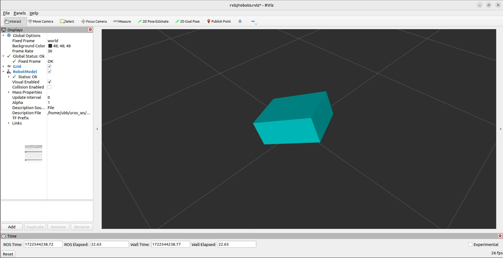

# Simulación de datos de una MPU6050 en Rviz usando una ESP32

Este trabajo consiste en transmitir datos de un MPU6050 usando una ESP32 usando microROS para luego simular los datos recibidos en Rviz. Para esto se creó un nodo que publica en ```/imu/raw_data``` en la ESP32 que armara el mensaje en estandar de sensor Imu para ROS2 que luego es transmitido por puerto serial hacia el computador. Los datos son recibidos en una máquina virtual donde se corre un nodo que se suscribe a ```/imu/raw_data``` para recibir los datos y luego publicarlos en ```/tf``` como una tranformacion y así visualizar cambios en la simulación. El modelo de robot simulado es un cubo simple.

Todos los archivos personalizados se encuentran comentados para el entendimiento del usuario.

Este trabajo fue realizado en ROS2 Iron.


## Setup
Para lograr ejecutar el programa se debe clonar el rositorio e instalar las librerias de ros usando los siguientes comandos:

Inicializar ROS.

```source /opt/ros/iron/setup.bash```

Se instala el paquete del agente.

``colcon build``

``source install/local_setup.bash``

Se dan permisos para acceder al USB

``sudo chmod 777 /dev/ttyUSB0``

## Simulación en Rviz
Para simularlo en Rviz se debe ubicar en la carpeta donde se haya clonado el repositorio. Se necesitarán 3 terminales para ejecutar el agente, el nodo tf.py que publica las transformadas y el que ejecutará Rviz:



Primera terminal:
Inicializar ROS.

``source /opt/ros/iron/setup.bash``

Inicializar el agente.

``source install/local_setup.bash``

Se hecha a correr el agente.

``ros2 run micro_ros_agent micro_ros_agent serial --dev /dev/ttyUSB0``

Segunda terminal:
Inicializar ROS.

``source /opt/ros/iron/setup.bash``

Se hecha a correr el nodo.

``python3 tf.py``

Tercera terminal:
Inicializar ROS.

``source /opt/ros/iron/setup.bash``

Se inicia Rviz.

``rviz2 -d rviz/roboto.rviz``


El video de demostración se encuentra en [este link a Youtube](images/video/Rviz.webm)

